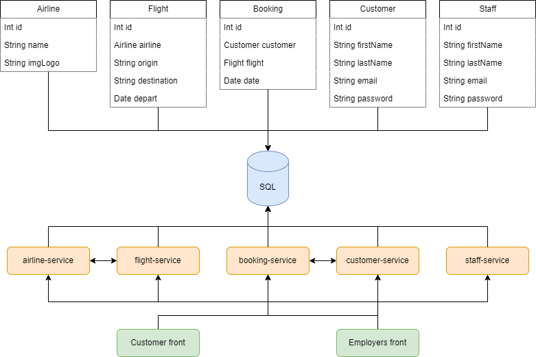

# uni-tel
Uni-Tel is a travel agency that appears in Grand Theft Auto: San Andreas, located around Los Santos. This project is a website of this agency, used by customers and its staff to create bookings and others tasks.


## Index
1. [Scheme](#scheme)
2. [System Requirements](#system-requirements)
3. [Data (SQL or H2)](#data-sql-or-h2)
4. [Microservices Set Up](#microservices-set-up)

## System Requirements
* Java (version 17)
* Maven (version 3.2.0)
* Spring Boot (version 3.2.2)
* MySQL (version 8.0)

## Scheme
With this image you can take a look at the schema of the application. It uses four relational tables and other one just used by employees, because flights depend to some airlines and for the same way, bookings depend to costumers. About the microservices, Airlines microservice have a relationship with Flights microservice, and Costumers microservice have relationship with Costumers microservice.



## Data (SQL or H2)
Microservices are set up by default with H2, simply start the service and the tables along with their data will be created for development and testing purposes. Personally, I suggest using an SQL database like MySQL. Just run the import.sql file from the project's root folder, and you'll have the database, tables, and all data created with a single script. Remember to change the configuration of each service to switch between H2 and your database management system.

## Microservices Set Up
I recommend using the following Maven command before run the service
```bash
mvn clean install
```